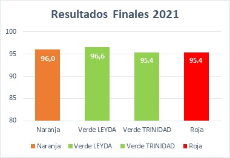

### Entrega_01
# Entrega grupal: Propuesta de proyecto y datos a trabajar

### Grupo: Felipe Gallet, Ignacio Muñoz y María Victoria Yeme

## **1. Tema elegido:** La producción del vino

#### En Chile el vino es uno de los principales elementos de exportación a otros mercados, además de ser uno de los productos más importantes y conocido de nuestro país. En los últimos años ha sufrido críticas junto a otras formas de hacer agricultura sobre su poco respeto por el medio ambiente y como esta industria utiliza ciertos elementos como el agua de manera inadecuada y no tomando el real peso de estos actos. Por esta razón diferentes organizaciones han creado estándares mínimos para certificar la producción de vino.

#### Es por esto que nuestro proyecto de investigación se enfocará en el vino sustentable y su proceso, como también en las diferencias y la comparación con el proceso tradicional del vino. Pero ¿qué es el vino sustentable?

#### El vino sustentable hace referencia a las prácticas agrícolas y de elaboración del vino que siguen los viticultores para obtener una certificación que compruebe que cumplen con ciertos estándares ecológicos. Estos abarcan desde el compostaje de desechos para producir fertilizantes, la conservación del agua, la disminución en el consumo de energía hasta cómo es el uso de pesticidas.

#### Hoy en día existe el Código de Sustentabilidad creado por la Industria Vitivinícola Chilena. Este es un estándar de carácter voluntario, que guía a las empresas vitivinícolas en el desafío de trabajar de manera sustentable sobre la base de requisitos en tres áreas complementarias: viñedo, bodega-planta de embotellado y área social.

#### Es una iniciativa abierta a todas las viñas chilenas y el objetivo es posicionar al vino chileno, por sobre las empresas de manera individual. Se ha logrado consolidar como una iniciativa relevante para el sector vitivinícola nacional y ha empezado a formar parte de la imagen del vino chileno. 

### **2. Hipótesis:**  ¿Qué se quiere demostrar o revelar? 

#### La producción sustentable de vino en Chile está logrando posicionarse por sobre el tradicional rápidamente como el principal método de producción.

### **3. Antecedentes:**

#### Los datos ha investigar son el número de viñas sustentables en Chile y en cuanto tiempo se ha logrado ese número. Es necesario hacer una comparación entre la cantidad de viñas sustentables y las tradicionales.  Además, ver y analizar la forma en que se entrega la certificación, cuáles son los parámetros y las garantías que se toman en cuenta. 

#### Los datos son creados por “Vinos de Chile”, agrupación que se encarga de certificar a las diferentes viñas del país. La naturaleza de estos es de manera cuantitativa, ya que los productores deben estar por sobre ciertos parámetros para cumplir los requisitos mínimos. Además, podemos contar con el análisis de una viña en específico respecto a estos casos, la Viña Ventisquero, la primer Viña en Chile que logró la sustentabilidad.

#### Anteriormente se han hecho múltiples publicaciones sobre qué es un vino sustentable, además de los requisitos mínimos para poder tener esa denominación. Tanto “Vinos de Chile” como diferentes agricultores han entregado su visión de por qué es importante y por qué Chile debe optar por esta opción, además de incentivar el uso de practicas sustentables para así cooperar y optar por una mejor producción. 

### **4. ¿Cuál es la historia de su propuesta de investigación? ¿Qué es lo nuevo?**

#### El vino fue y sigue siendo un aporte económico significativo en Chile. Además, es parte de su cultura e historia. Como grupo nos interesaba abordar un tema con historia y que tenga gran valor en la sociedad chilena. El vino se remota desde apróxidamente el siglo XIX y varios de los vinos chilenos han logrado alcanzar un gran éxito mundial. Asimismo, creemos que su análisis es adecuado para encontrar una gran cantidad de datos y articularlos de forma interactiva en nuestra página web. De esta manera, nos pusimos a pensar en temas contingentes que le estan dando un vuelco a la industria de la elaboración del vino. Es así, como nos encontramos con los distintos procesos de producción del vino y la naciente preocupación por el medio ambiente. Actualmente, es importante pensar en la sustentabilidad y en las generaciones futuras. Por lo anterior, muchas industrias estan buscando adpatarse a las nuevas preocupaciones del mundo. El vino ha logrado encontrar nuevas formas más sustentables de elaborar sus productos, y a lo anterior se le ha dado un reconocimiento importante. Creemos que como consumidores y productores debemos ser conscientes, tanto en lo social como en lo ambiental. Es así como nos interesó investigar esta nueva rama del vino y cuáles son los procesos que deben hacer para dar cara a esta nueva problematica. Creemos que el vino sustentable es un nuevo y mejor futuro para la Industria Vitivinícola Chilena.

### **5. ¿Cómo planea trabajar los datos?**

#### ¿Qué datos necesita para probar su hipótesis? 

##### Necesitamos comprobar, análizar y diferenciar las viñas que ocupan procesos sustentables de las que no lo hacen. Además, encontrar datos que prueben los beneficios que tienen estos nuevos procesos para el medio ambiente. Incluso, nos gustaría comparar los impactos de ambos procesos.

#### ¿Qué datos tiene y qué datos necesita conseguir aún? Elabore una lista de fuentes de datos.

##### Tenemos datos acerca de los procesos para certificarse como una industria sustentable y cuáles son los requisitos. Nos falta buscar más información de las ubicaciones de las viñas ecológicas en Chile, más datos para comparar los beneficios, entre otros. Además, varias páginas del gobierno mencionan que Chile es uno de los productores más sostenibles del mundo, nos gustaría comprobar eso.

#### ¿Qué datos no existen y cómo los obtendrá? 

##### Aún no estamos conscientes de datos que no existen. Creemos que como es un tema interesante para muchas personas y expertos tenemos mucha información a nuestro favor.

#### ¿Qué datos son públicos y cuáles no?

##### La mayoría de las viñas son privadas, esos podrían ser datos ocultos. Más que todo las ganancias. Sin embargo, en sus páginas e investagaciones hay suficiente información para estudiar este campo. Tanto desde la elaboración tradicional como desde la nueva, la medioambiental. 

#### ¿Qué datos son confiables y cuáles no?

##### Los del gobierno son confiables. Los de privados habría que investigar mucho más. Los certificados legales son de gran ayuda.

### **6. ¿Cuál es el resultado mínimo previsible del trabajo a realizar? ¿Cuál es el máximo?**

#### ¿Qué es lo mínimo que se puede contar como historia con los datos que tienen?

##### Con los datos que contamos actualmente, lo mínimo que se puede contar como historia es respecto al proceso en que las viñas empezaron a cambiar ciertas prácticas en la producción del vino para el desarrollo sustentable de este. Contar los beneficios y como se ha impulsado este cambio en la industria vinícola, una de las industrias más importantes y reconocidas de nuestro país. Contar por qué es relevante el desarrollo sustentable del vino en Chile.

#### ¿Qué es lo máximo que se puede contar como historia con los datos que tienen?

##### Lo máximo que podemos contar como historia es usar los datos que tenemos y los que recolectemos a futuro, para armar un proyecto comprensible con imagenes o dibujos explicativos y herramientas interactivas, para facilitar la comprención de la audiencia.

#### ¿Cuáles son las preguntas que se pueden responder con los datos?

##### Con los datos disponibles en la web, podremos responder a preguntas claves para este tema. Partiendo por diferenciar la producción clásica de vino a la sustentable, luego el porqué se ha impulsado la producción sostenible de vinos y cuáles son sus beneficios. Otra pregunta a responder será relacionada a comparar la producción chilena de vino sustentable con la producción en otros países vinícolas. 

#### ¿Qué tipo de elementos digitales les gustaría tener?

##### En nuestro proyecto buscaremos tener información dura, combinada con imágenes explicativas. Esto ya que el uso de imágenes nos ayudarán a poder explicar qué es el vino sustentable, sus procesos, sus beneficios y demás características, de una manera más simple y amena. Además, el uso de gráficos también podrá ser un gran aporte para el proyecto. 

#### ¿Cómo esos elementos ayudarán a contar su historia?

##### Al combinar tanto la información dura, como el uso de imágenes y gráficos, buscaremos enriquecer nuestro proyecto periodístico. Información dura porque siempre es necesaria, pero también alto uso de imágenes para explicar procesos y detalles importantes sobre la producción sustentable del vino. Por último, el uso de gráficos nos permitirá comparar ciertas cosas, como Chile versus otros países vinícolas en la materia.

### **7. Base de datos inicial**

#### [Link sobre Sustentabilidad sectorial: Vinos de Chile](https://www.odepa.gob.cl/wp-content/uploads/2019/07/SustentabilidadVinosDeChile2015.pdf)

#### [Link sobre Chile uno de los productores de vino más sostenibles del mundo](https://blog.investchile.gob.cl/bloges/chile-productor-vino-sostenible)

#### [Link sobre Código de Sustentabilidad y Viñas certificadas](https://www.sustentavid.org/)

## Presentación

#### [Video](https://www.youtube.com/watch?v=nMmDidR8_ag)
#### [PDF](https://drive.google.com/file/d/1r_mE_CwL8H5Z9zSl-4VSW0INp-KvzLPa/view?usp=sharing)